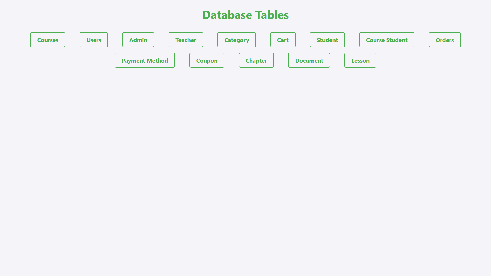
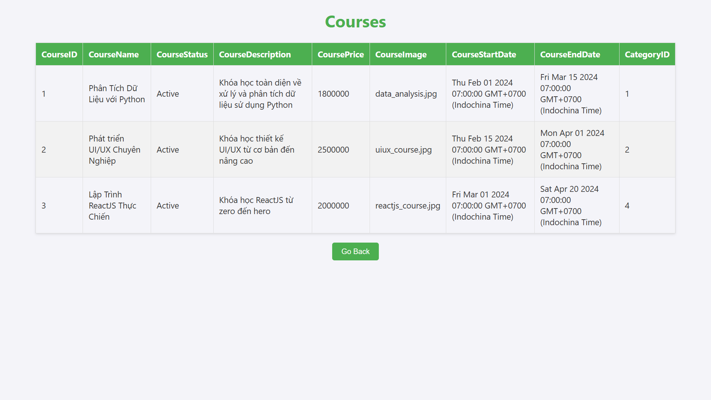
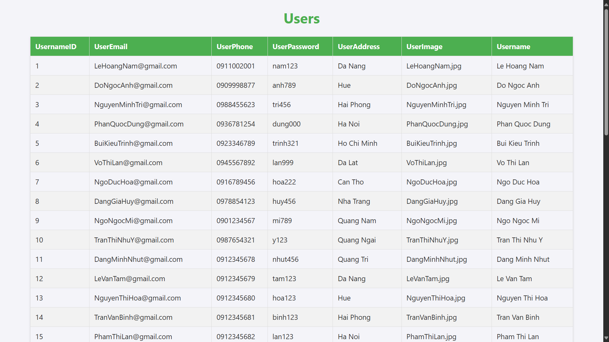
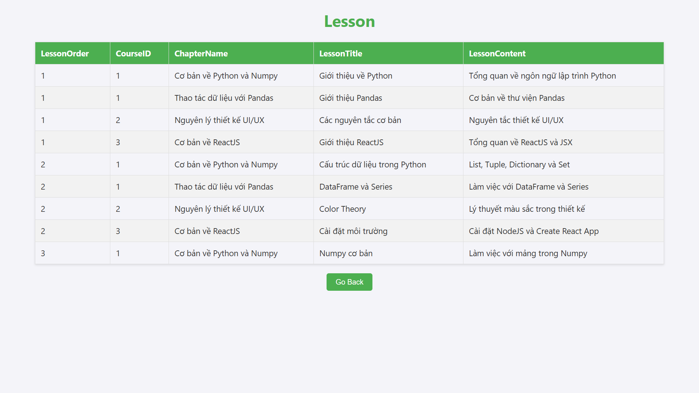

# Online Course Platform Database

This project contains the SQL scripts to create and manage the database for an online course platform. The database includes tables for users, students, instructors, admins, courses, orders, payments, and more.

## Database Schema
The database schema is designed to support the various functionalities of an online course platform. Below are the key tables and their relationships:

- **Users**: Stores user information including email, phone number, password, address, image, and name.
- **Students**: Extends the Users table with student-specific attributes.
- **Instructors**: Extends the Users table with instructor-specific attributes.
- **Admins**: Extends the Users table with admin-specific attributes.
- **Courses**: Stores course details such as name, status, description, price, image, start date, end date, and category.
- **Categories**: Stores course categories.
- **Cart**: Stores shopping cart details.
- **Coupon**: Stores coupon details for discounts.
- **Orders**: Stores order details including payment status and time.
- **Payments**: Stores payment methods including Internet Banking and Visa.
- **Reviews**: Stores course reviews by students.
- **Lessons**: Stores lesson details within courses.
- **Documents**: Stores documents related to courses.
- **Tests**: Stores test details within courses.
- **Chapters**: Stores chapter details within courses.

## Scripts
The project includes the following SQL scripts:

- **[BTL2v2.sql](BTL2v2.sql)**: Contains the SQL commands to create and populate the database tables.
- **[CreateTableBTL2HCSDL.sql](CreateTableBTL2HCSDL.sql)**: Contains the SQL commands to create the database tables with a different structure.

## How to Use

1. Run the `BTL2v3.sql` script to create the database and tables.
2. Navigate to the `WebInterface/backend` directory and run `npm start` to start the server.
3. Open [http://localhost:3500](http://localhost:3500) in your browser to visualize the tables.

## Database Schema Diagrams

## Screenshot UI

  
  
  
  

