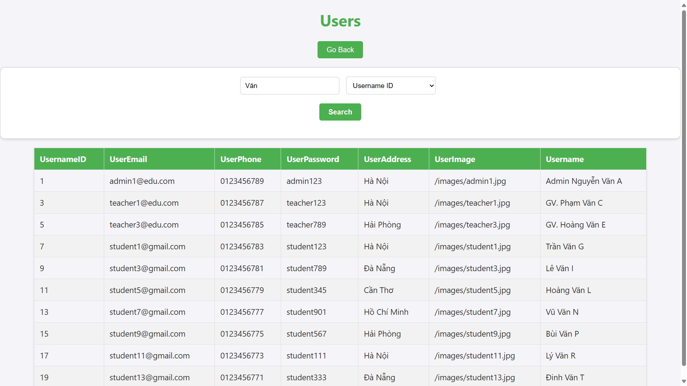

# Online Course Platform Database

This project contains the SQL scripts, stored procedures, functions, and backend code to create and manage the database for an online course platform. It also includes a user interface for interacting with the database. The database includes tables for users, students, instructors, admins, courses, orders, payments, and more.

## Table of Contents
- [Database Schema](#database-schema)
- [Scripts](#scripts)
- [How to Use](#how-to-use)
- [Database Schema Diagrams](#database-schema-diagrams)
- [Screenshot UI](#screenshot-ui)

## Database Schema
The database schema is designed to support the various functionalities of an online course platform. Below are the key tables and their relationships:

- **Users**: Stores user information including email, phone number, password, address, image, and name.
- **Students**: Extends the Users table with student-specific attributes.
- **Instructors**: Extends the Users table with instructor-specific attributes.
- **Admins**: Extends the Users table with admin-specific attributes.
- **Courses**: Stores course details such as name, status, description, price, image, start date, end date, and category.
- **Categories**: Stores course categories.
- **Coupon**: Stores coupon details for discounts.
- **Orders**: Stores order details including payment status and time.
- **Payments**: Stores payment methods including Internet Banking and Visa.
- **Reviews**: Stores course reviews by students.
- **Lessons**: Stores lesson details within courses.
- **Documents**: Stores documents related to courses.
- **Tests**: Stores test details within courses.
- **Chapters**: Stores chapter details within courses.

## Scripts
The project includes the following SQL scripts:

- **[_____finalsqlv5.sql](SQL/_____finalsqlv5.sql)**: Contains the SQL commands to create the database and tables.
- **[WebInterface/backend](WebInterface/backend)**: Contains the backend server code to interact with the database.

## How to Use

1. Run the `_____finalsqlv5.sql` script to create the database and tables. This file contains all the code for creating tables, triggers used to validate data, functions, procedures, and triggers used to update the corresponding data tables when a certain data changes.
2. Navigate to the `WebInterface/backend` directory and modify the `.env` file to include the correct database connection details.
3. Run `npm install` to install the necessary dependencies.
4. Run `npm start` to start the server.
5. Open [http://localhost:3500](http://localhost:3500) in your browser to visualize the tables. The web interface will have all the corresponding data tables, and specific functions for some tables (see sql file).

## Database Schema Diagrams

## Screenshot UI

  
  
  
  

