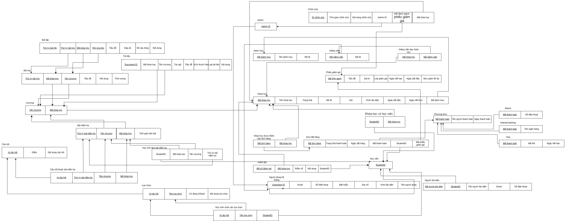

# Online Course Platform Database

This project contains the SQL scripts to create and manage the database for an online course platform. The database includes tables for users, students, instructors, admins, courses, orders, payments, and more.

## Database Schema

